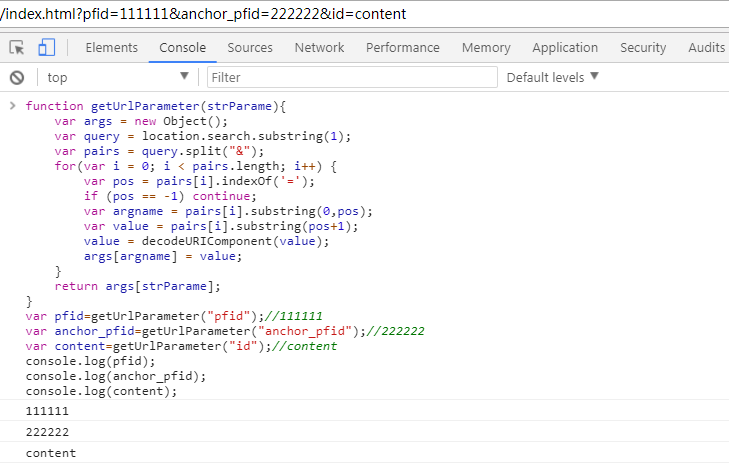
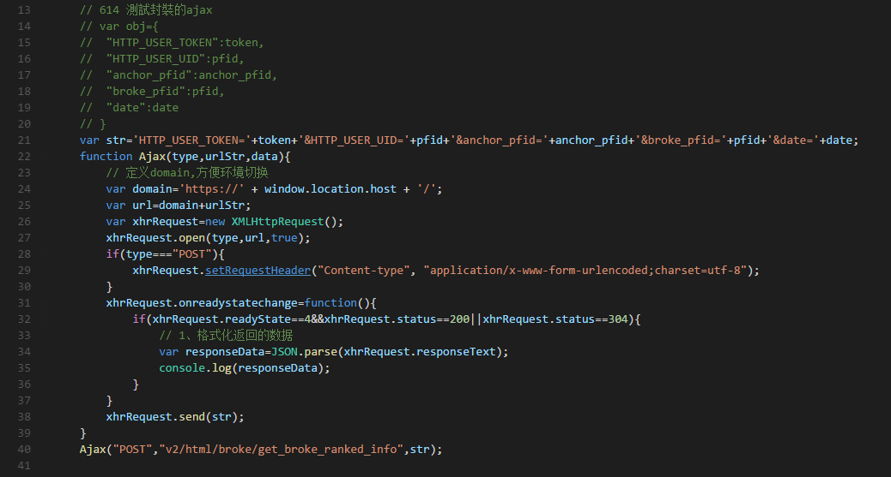
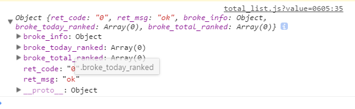
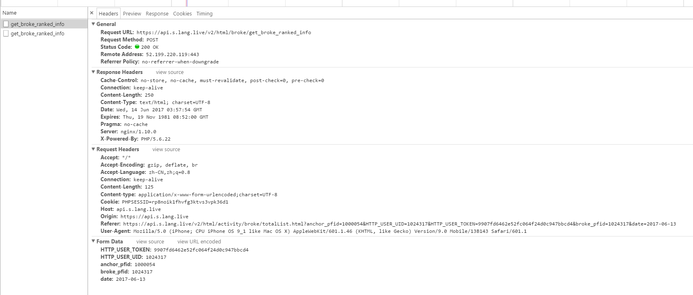
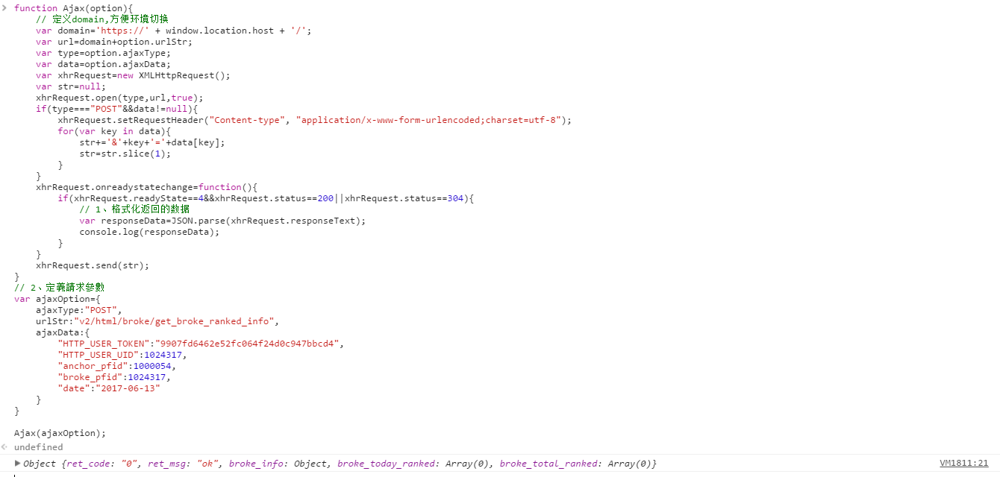
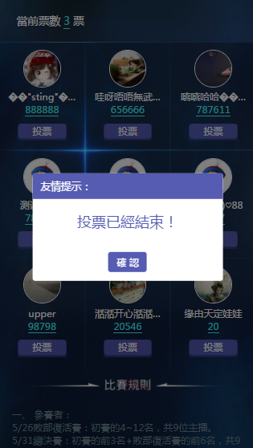

### git常用命令
+ git add .
+ git commit -m '这次提交的注释内容'
+ git pull --rebase	//push之前先pull防止有人在你之前push
+ git push 提交/如果还是不慎需要合并
+ 注意如果进入shell命令冲突界面解决步骤：Insert>Esc>:wq>Enter

### 一、合并代码
```javascript
	
	//git checkout branchName folderName
	//git checkout branchName path
	//一、如：以下都是在主分支master上执行的命令
	//1 把dev 分支上app文件夹下所有的文件合并到主分支master上.
	git checkout dev app
	//2 部分文件更新需要合并，如单独合并app/css/index.css到master主分支上.
	git checkout dev app/css/index.css
	//3 部分文件夹更新需要合并dev分支上app的js文件夹下有多个JS文件都更新了.
	git checkout dev app/js
	//合并过来的文件或者文件夹在主分支master上都是默认add过的，
	//然后需要在master分支上commit,再push即可完成合并更新！

	//二、 如果需要把master上指定文件或者文件夹合并到dev，先切换到dev:
	git checkout dev
	// 其它同上

```

### 二、js介绍以及如何使用
+ 1、html/js/publicVersion.js（封装好的JS方法）
	+ 1、h5进入个人主页
	+ 2、h5进入直播间
	+ 3、h5关注
	+ 4、h5分享
	+ 5、追踪主播
	+ 6、大部分活动页面的顶部需要的参数,具体字段名字需跟对应后台确认

```javascript

	var token = '<?=isset($_REQUEST["HTTP_USER_TOKEN"])?$_REQUEST["HTTP_USER_TOKEN"]:""?>';
	var pfid = '<?=isset($_REQUEST["HTTP_USER_UID"])?$_REQUEST["HTTP_USER_UID"]:0?>';
	var share_url_head='<?= DOMAIN_H5;?>';
	var anchor_id='<?=isset($_REQUEST["anchor_pfid"])?$_REQUEST["anchor_pfid"]:0?>';
	var domain='<?= DOMAIN_API;?>';
	
```

+ 2、/html/my/fillInfo.js 包含客戶端的上传照片的公用方法

+ 3、判断倒是是IOS还是Android,**下面很多公用方法用到**

```javascript

	var u = navigator.userAgent,
    app = navigator.appVersion;
	var isiOS = !!u.match(/\(i[^;]+;( U;)? CPU.+Mac OS X/); //ios终端

```

### 三、关于上传照片的问题（如magic活动）

+ 点击上传照片按钮会调用客户端的方法，客户端返回URL给你
+ suppportCamera参数是20170512日新增，是否可以拍照

```javascript
	
	//1、点击上传按钮调用客户端的方法，弹出选择文件还是截屏还是摄像头
	if(isiOS==true){
          window.webkit.messageHandlers.langWeb2App_camera.postMessage({body:'{"needupload":"1","cropImg":"0","supportCamera":"0"}'});
       }else{
           javascriptinterface.langWeb2App_camera("1","0");
    }
	//2、客户端通过如下方法返回以及上传的img的url，如果用得到自己定义变量或者函数接收并操作
	var loadingSrc=null; 
	function langApp2Web_camerartn(imgUrl) {
	   $("img[data-src='imgSrc']").attr('src', imgUrl).removeAttr("data-src").on("load",function(){
		   loadingSrc=imgUrl;
		   $(".upload-agree").css({
				display:"block"
			});
	   });
	}

```

+ cropImg:是否允许客户端裁剪，0不允许，1允许
+ supportCamera:是否允许客户端调用摄像头，0不允许,1允许

### 四、APP內部浏览器顶部左上角返回按钮

``` javascript

	// 客户端浏览器的返回键操作，调用客户端的方法，默认执行
	//flag:1直接返回直播间或者app，flag:0返回上一步操作
	if(isiOS==true){
		window.webkit.messageHandlers.langWeb2App_topback.postMessage({body:'{"flag":"1"}'});
	} else {
		javascriptinterface.langWeb2App_topback("1");
	}

```

### 五、页面之间的跳转
+ 1、目前跳转form表单的domain后端不注入，可以JS动态替换

```javascript
	
	//如：替换方法
	function resetFormAction(option){
		// console.log(option);
		var domain=window.location.origin+"/";
		for(var key in option){
			document.getElementById(key).action=domain+option[key];
		}
	}
	option={
		"key":"value"(可以多组)
    }
	key:表单元素ID(string)
	value:url片段(string可带参数)

	//使用
	var option={
        "jumopTotal":"v2/html/activity/midautumn/total.html",
        "jumpWishing":"v2/html/activity/midautumn/wishing.html?key=jumpTrouble",
        "jumpTrouble":"v2/html/activity/midautumn/trouble.html"
    }
    resetFormAction(option);

```

+ 2、form表单提交形式,如：magic

```javascript
	
	//html code
	//<!-- 跳转到总榜 -->
    <form action="<?php echo DOMAIN_H5 ?>v2/html/activity/magic/total.html" method="post" class="jumpTo">
        <input type="hidden" name="HTTP_USER_TOKEN" class="access_token" value='<?=isset($_REQUEST["HTTP_USER_TOKEN"])?$_REQUEST["HTTP_USER_TOKEN"]:0; ?>'>
        <input type="hidden" name="HTTP_USER_UID" class="pfid" value='<?=isset($_REQUEST["HTTP_USER_UID"])?$_REQUEST["HTTP_USER_UID"]:0; ?>';>
    </form>
	
	//js code
	// 跳转到总榜
	$(".all-btn").click(function(){
		$(".jumpTo").trigger('submit');
	});
	
	//如果跳轉到個人，需要先賦值再跳轉，
	// 0613 跳轉到個人頁面
	//如：https://api.s.lang.live/v2/html/activity/broke/totalList.html?anchor_pfid=1000054&HTTP_USER_UID=1024317&HTTP_USER_TOKEN=9907fd6462e52fc064f24d0c947bbcd4&broke_pfid=1024317&date=2017-06-14

	$("#newPfid").val(pfid);
	$("#jumpPersonal").trigger('submit');

```

+ 3 获取URL指定参数的值

```javascript
	
	function getUrlParameter(strParame){
		var args = new Object();
        var query = location.search.substring(1);
        var pairs = query.split("&");
        for(var i = 0; i < pairs.length; i++) {
            var pos = pairs[i].indexOf('=');
            if (pos == -1) continue;
            var argname = pairs[i].substring(0,pos);
            var value = pairs[i].substring(pos+1);
            value = decodeURIComponent(value);
            args[argname] = value;
        }
        return args[strParame];
	}
	//使用如下图

```

+ 

### 六、关于追踪(即关注)

+ 点击追踪按钮

```javascript

	//1、h5关注公用方法
	function follow(pfid){
		if(isiOS==true){  
				window.webkit.messageHandlers.langWeb2App_httpreq.postMessage({body:'{"base_url":"'+domain+'v2/","requst_url":"friend/follow","param":{"be_pfid":"'+pfid+'","action":"1"}}'});
	        }else{
				javascriptinterface.langWeb2App_httpreq(domain+'v2/friend/follow','{"key": ["be_pfid","action"],"value": ["'+pfid+'","1"],"needlogin": false,"callback": true,"callback_tag": "follow"}'); 
	        }
	}
	//2、例如： 點擊追蹤按鈕
	$(".user-list").on('click', '.willFollow', function(event) {
		var willPfid=$(this).attr('data-pfid');
		$(this).addClass('followed');
		console.log(willPfid);
		//公用方法
		follow(willPfid);//调用公用方法，需要被关注的pfid
	})
	//3、客戶端返回追蹤狀態,通过该方法返回追踪结果，成功追踪是按钮消失还是按钮改变样式，具体看情况
	function langApp2Web_httprtn(result,follow){
		if(isiOS == true){
			if(JSON.parse(result).ret_code == "0"){
				$(".followed").css({
					display:"none"
				}); 
			}else{
				alert(JSON.parse(result).ret_msg);
			}
		}else{
			if(JSON.parse(follow).ret_code == "0"){
				$(".followed").css({
					display:"none"
				}); 
			}else{
				alert(JSON.parse(follow).ret_msg);
			}
		}
			
	}

```

### 七、点击头像跳转直播间还是跳转个人主页

```javascript

	//1、公用方法
	//h5进入个人主页
	function h5toHomepage(pfid,nickname){
		if(isiOS==true){
				window.webkit.messageHandlers.langWeb2App_openActivity.postMessage({body:'{"pfid":"'+pfid+'","className":"LNGOtherInfoViewCtrl","creatNav":"1"}'});
			} else{
			 	javascriptinterface.langWeb2App_openActivity('com.lang.lang.ui.activity.user.UserCenterActivity','{"pfid":"'+pfid+'","nickname":"'+nickname+'"}');
			}
	}
	
	//h5进入直播间
	function h5toRoom(pfid,nickname,liveid,liveurl,livekey,direction,cdn_id){
		if(isiOS==true){
				window.webkit.messageHandlers.langWeb2App_openActivity.postMessage({body:'{"live_id":"'+liveid+'","className":"PlayFlowViewController","live_url":"'+liveurl+'","live_key":"'+livekey+'","stream_direction":"'+direction+'","pfid":"'+pfid+'","cdn_id":"'+cdn_id+'"}'});
			}else{
				javascriptinterface.langWeb2App_openActivity('com.lang.lang.ui.activity.room.YunfanLiveActivity','{"pfid":"'+pfid+'","nickname":"'+nickname+'","live_id":"'+liveid+'","stream_direction":"'+direction+'","cdn_id":"'+cdn_id+'"}')
			}
	}
	//direction:為0是竖屏，1是横屏
	//2、点击头像到底该怎么跳转根据live_id是否为null，
	//为null没有在直播，头像下面没有直播ICON，点击调用h5toHomepage(pfid,nickname)跳转个人主页
	//live_id不为null,正在直播，头像下面有直播ICON，
	//点击调用h5toRoom(pfid,nickname,liveid,liveurl,livekey,direction)跳转直播间
	//如下面：
	// 点击头像判断是跳转到直播间还是主页，所需要的参数在渲染DOM之前添加到对应的DOM上
	$("#users-one").on('click', '.main-img', function(event) {
		event.preventDefault();
		event.stopPropagation();
		/* Act on the event */
		// pfid,nickname,liveid,liveurl,livekey,direction
		var pfid=$(this).attr('data-pfid');
		var nickname=$(this).attr('data-nickname');
		var liveid=$(this).attr('data-liveid');
		var liveurl=$(this).attr('data-liveurl');
		var livekey=$(this).attr('data-livekey');
		var direction=$(this).attr('data-direction');
		if(liveid!="null"){
			// 进入直播间
			h5toRoom(pfid,nickname,liveid,liveurl,livekey,direction);
			// alert("进入直播间");
		// 如果没在直播，进入个人主页	
		}else{
			h5toHomepage(pfid,nickname);
			// alert("进入个人主页");
		}
	});

```

### 八、分享按钮(页面中的分享按钮和浏览器右上角的分享按钮)，如果需要显示用户信息，把参数在url后面拼接，分享方法的参数具体问产品要文案以及图片。被分享的页面需要新建一个页面内部如果有分享按钮需要去除(部分逻辑也需要去除)

```javascript

	**//注意：分享出去的頁面不需要相互跳轉，去掉跳轉的JS以及html內的跳轉按鈕**
	//分享的參數需要注入的比如注入

	//1、浏览器右上角默认分享按钮方法
	function needShare(imgUrl,desc,pageTitle,pageUrl){
		var androidShareJson={"imageurl":imgUrl,"description":desc,"title":pageTitle,"shareUrl":pageUrl};
		var iosShareJson={"img_url":imgUrl,"share_content":desc,"share_title":pageTitle,"share_link":pageUrl}
		if(isiOS==true){
			window.webkit.messageHandlers.langWeb2App_needShare.postMessage({body:JSON.stringify(iosShareJson)})
		} else{
			javascriptinterface.langWeb2App_needShare(JSON.stringify(androidShareJson));
		}
	
	}
	//、h5分享公用方法：页面中的按钮点击分享方法
	function shareInterface(imgUrl,desc,pageTitle,pageUrl){
		var androidShareJson={"imageurl":imgUrl,"description":desc,"title":pageTitle,"shareUrl":pageUrl};
		var iosShareJson={"img_url":imgUrl,"share_content":desc,"share_title":pageTitle,"share_link":pageUrl}
		if(isiOS==true){
				window.webkit.messageHandlers.langWeb2App_share.postMessage({body:JSON.stringify(iosShareJson)});
			} else{
				javascriptinterface.langWeb2App_share(JSON.stringify(androidShareJson));
		}
	
	}
	// 例如Disney活动(需要显示用户信息)：
	// 弹出分享面板
	$(".shareBtn").bind("click",function(){
	    shareInterface(
	       "http://playback-langlive.ufile.ucloud.com.cn/e634d9705beb4f8e9ab506748c940e84",
	        "熱情夏日之旅，點亮心中奇夢！快來幫助主播實現迪士尼夢幻之旅計劃~",
	        "迪士尼夢幻之旅展開中",
	        share_url_head + 'html/activity/disney2017/map_share.html?anchor_pfid='+anchor_id+'&pfid='+pfid
	                );
	})
	
	needShare(
	     "http://playback-langlive.ufile.ucloud.com.cn/e634d9705beb4f8e9ab506748c940e84",//分享的圖片
	     "熱情夏日之旅，點亮心中奇夢！快來幫助主播實現迪士尼夢幻之旅計劃~",//分享的內容
	     "迪士尼夢幻之旅展開中",//分享的標題
	     share_url_head + 'html/activity/disney2017/map_share.html?anchor_pfid='+anchor_id+'&pfid='+pfid
	);
	
```

+ 20170718新增加分享到facebook,必須加上如下meta标签到head(内容变化)

```javascript

	<meta property="description" content="幫助主播收集星座卡牌，成為星座達人，獲得每日推薦吧~"/>
    <meta property="og:app_id" content="1787229064893053"/>
    <meta property="og:title" content="星座達人秀~火爆展開中~"/>
    <meta property="og:type" content="website"/>
    <meta property="og:description" content="幫助主播收集星座卡牌，成為星座達人，獲得每日推薦吧~"/>
    <meta property="og:image" content="http://playback-langlive.ufile.ucloud.com.cn/241be4d7aaefb46963c1fec0fbf417a3"/>
    <meta property="og:url" content="https://api.s.lang.live/v2/html/activity/constellation/rank.html" />


```


### 九、h5调出发布动态界面

```javascript
	
	//android
	1、进入发布动态：
	第一个参数：com.lang.lang.ui.activity.sns.SnsPublishActivity
	第二个参数：{"content":"带入的默认文字","imgpaths":["本地路径","本地路径"]}
	
	2、进入动态详情：
	第一个参数：com.lang.lang.ui.activity.SnsDetailActivity
	第二个参数：{"sns_id":"动态id"}
	//iOS  H5调用发布动态页面参数
	className:LANGGraffitiWallBuilderViewController
	param:{content:"默认文本"}//可选参数
	
	iOS  H5调用发布动态详情
	className:LANGPostViewController
	param:{postId:"sns_id"}//必填参数

	//---------------------------------

	// 調起發佈動態
	function releaseAlert(content){
		if(isiOS==true){
			window.webkit.messageHandlers.langWeb2App_openActivity.postMessage({body:'{"content":"'+content+'","className":"LANGGraffitiWallBuilderViewController"}'});
		} else{
		 	javascriptinterface.langWeb2App_openActivity('com.lang.lang.ui.activity.sns.SnsPublishActivity','{"content":"'+content+'"}');
		}
	}


	//-----------------------
	// 調起發佈詳情頁面,今日詳情頁
	function releaseDetial(sns_id){
		if(isiOS==true){
			window.webkit.messageHandlers.langWeb2App_openActivity.postMessage({body:'{"postId":"'+sns_id+'","className":"LANGPostViewController"}'});
		} else{
		 	javascriptinterface.langWeb2App_openActivity('com.lang.lang.ui.activity.SnsDetailActivity','{"sns_id":"'+sns_id+'"}');
		}
	}

```

### 十、原生默认的表单提交代替JQ的trigger('submit');

```javascript

	btn.addEventListener('click',functioin(){
		form.submit();
	},false);
	btn.onclick=function(){
		form.submit();
	}

```


## 注：其他常用封裝
#### 一、ajax的封裝:public/Ajax/Ajax.js

```javascript

	// 614 測試封裝的ajax:post 測試可以使用
	var str='HTTP_USER_TOKEN='+token+'&HTTP_USER_UID='+pfid+'&anchor_pfid='+anchor_pfid+'&broke_pfid='+pfid+'&date='+date;
	function Ajax(type,urlStr,data){
		// 定义domain,方便环境切换
		var domain='https://' + window.location.host + '/';
		var url=domain+urlStr;
		var xhrRequest=new XMLHttpRequest();
		xhrRequest.open(type,url,true);
		if(type==="POST"){
			xhrRequest.setRequestHeader("Content-type", "application/x-www-form-urlencoded;charset=utf-8"); 
		}
		xhrRequest.onreadystatechange=function(){
			if(xhrRequest.readyState==4&&xhrRequest.status==200||xhrRequest.status==304){
				// 1、格式化返回的数据
				var responseData=JSON.parse(xhrRequest.responseText);
				console.log(responseData);
			}
		}
		xhrRequest.send(str);
	}
	Ajax("POST","v2/html/broke/get_broke_ranked_info",str);


	


	
	//GET:測試可以用如：http://wjf444128852.github.io/html/handlebars/degula/
	function Ajax(type,urlStr,data){
		// 定义domain,方便环境切换
		var domain='https://' + window.location.host + '/';
		var url=domain+urlStr;
		var xhrRequest=new XMLHttpRequest();
		xhrRequest.open(type,url,true);
		if(type==="POST"){
			xhrRequest.setRequestHeader("Content-type", "application/x-www-form-urlencoded;charset=utf-8"); 
		}
		xhrRequest.onreadystatechange=function(){
			if(xhrRequest.readyState==4&&xhrRequest.status==200||xhrRequest.status==304){
				// 1、格式化返回的数据
				var responseData=JSON.parse(xhrRequest.responseText);
				console.log(responseData);
				// 2、获取指定的数据列表
				var users=responseData.data.users;
				// 3、操作返回的数据
				sortData(users);
			}
		}
		xhrRequest.send(data);
	}
	Ajax("GET","json-datas/degula.json",null);


```


### ajax封装的升级版

```javascript

	// 1、封裝AJAX函數
	function Ajax(option){
		// 定义domain,方便环境切换
		var domain='https://' + window.location.host + '/';
		var url=domain+option.urlStr;
		var type=option.ajaxType;
		var data=option.ajaxData;
		var xhrRequest=new XMLHttpRequest();
		var str=null;
		xhrRequest.open(type,url,true);
		if(type==="POST"&&data!=null){
			xhrRequest.setRequestHeader("Content-type", "application/x-www-form-urlencoded;charset=utf-8");
			for(var key in data){
				str+='&'+key+'='+data[key];
				str=str.slice(1);
			}
		}
		xhrRequest.onreadystatechange=function(){
			if(xhrRequest.readyState==4&&xhrRequest.status==200||xhrRequest.status==304){
				// 1、格式化返回的数据
				var responseData=JSON.parse(xhrRequest.responseText);
				console.log(responseData);
			}
		}
		xhrRequest.send(str);
	}
	// 2、POST：定義請求參數
	var postOption={
		ajaxType:"POST",
		urlStr:"v2/html/broke/get_broke_ranked_info",
		ajaxData:{	
			"HTTP_USER_TOKEN":token,
			"HTTP_USER_UID":pfid, 
			"anchor_pfid":anchor_pfid,
			"broke_pfid":pfid,
			"date":date
		}
	}
	
	Ajax(postOption);
	
	//3、GET：定义请求参数
	var getOption={
		ajaxType:"GET",
		urlStr:"v2/html/broke/get_broke_ranked_info",
		ajaxData:null
	}
	Ajax(getOption);
	
	**//说明Ajax(option)**option必须
	option{
		//1、ajaxType必须："GET"/"POST"
		ajaxType:"POST",
		//2、urlStr必须："string类型"
		urlStr:"xxxx",
		//3、ajaxData必须：POST时候为object{key:value}，GET的时候直接为：null
		ajaxData：null/object
  	}
	

```


### AJAX封装的智能版本(代替JQ的POST)

```javascript

	'use strict';
	// 1、封裝AJAX函數
	function nativeAjax(option,success,error){
		// 定义domain,方便环境切换
		var domain='https://' + window.location.host + '/';
		var url=domain+option.urlStr;
		var type=option.ajaxType;
		var data=option.ajaxData;
		var xhrRequest=null;
		if(window.XMLHttpRequest){
	        xhrRequest = new XMLHttpRequest();
	    } else {
	        xhrRequest = new ActiveXObject('Microsoft.XMLHTTP')
	    }
		var str=null;
		xhrRequest.open(type,url,true);
		if(type==="POST"&&data!=null){
			xhrRequest.setRequestHeader("Content-type", "application/x-www-form-urlencoded;charset=utf-8");
			for(var key in data){
				str+='&'+key+'='+data[key];
				str=str.slice(1);
			}
		}
		xhrRequest.onreadystatechange=function(){
			if(xhrRequest.readyState==4){
				if(xhrRequest.status==200){
					// 1.1、格式化返回的数据
					var responseData=JSON.parse(xhrRequest.responseText);
					// 1.2、这里操作数据--------
					success(responseData);
				}else{
					// 1.3、没成功返回HTTP状态码
					error(xhrRequest.status);
				}
			}
		}
		xhrRequest.send(str);
	}
	// 2、POST：定義請求參數
	var postOption={
		ajaxType:"POST",
		urlStr:"v2/html/broke/get_broke_ranked_info",
		ajaxData:{										
			"HTTP_USER_TOKEN":token,
			"HTTP_USER_UID":pfid, 
			"anchor_pfid":anchor_pfid,
			"broke_pfid":pfid,
			"date":date
		}
	}
	// 3、调用AJAX
	nativeAjax(postOption,function(data){
		// 3.1、请求成功回调
		console.log(data);
	},function(error){
		// 3.2、请求失败回调,返回HTTP状态码
		console.log(error);
	});
	
	
	
	//4、GET：定义请求参数
	var getOption={
		ajaxType:"GET",	
		urlStr:"v2/html/broke/get_broke_ranked_info",
		ajaxData:null		
	}
	Ajax(getOption,function(data){
		// 成功函数
		console.log(data);
	},function(error){
		// 失败返回HTTP状态码
		console.log(error);
	
	});
	// 使用说明
	// 一、option必须
	option={
		//1、ajaxType必须："GET"或者"POST"
		ajaxType:"",
		//2、urlStr必须："string类型"
		urlStr:"",
		//3、必须：POST时候为object{key:value}，GET的时候直接为：null
		ajaxData:null
	}
	// 二、success请求成功回调必须
	// 三：error请求失败回调必须

```

+ POST測試結果
+ 
+ 
+ 
+ 

+ ## 注意事項
+ 1、Content-Type: application/x-www-form-urlencoded;charset=utf-8；
	+ 此時的請求參數得是：'key=value&key2=value2'格式
+ 2、application/json;charset=utf-8；
	+ 此時的請求頭是：JSON.stringify(data)系列化之後的JSON格式，需要后台配合

### 二、关于DOM的常用封装

```javascript

	//1、ClassName切换,是否含有指定class
	function hasClass(elem,cls){
	    return elem.className.match(new RegExp('(\\s|^)'+cls+'(\\s|$)'));
	}
	// 2、没有就追加指定class
	function addClass(elem,cls){
	    if(!hasClass(elem,cls)){
	        elem.className+=" "+cls;
	    }
	}
	// 3、有就移除指定class
	function removeClass(elem,cls){
	    if(hasClass(elem,cls)){
	        var reg=new RegExp('(\\s|^)'+cls+'(\\s|$)');
	        elem.className=elem.className.replace(reg,"");
	    }
	}
	
	
	// 3、获取DOM
	// 3.1 
	window.$=HTMLElement.prototype.$=function(selector){
		return (this==window?document:this).querySelectorAll(selector);
	}
	// id=>$("#id")[0];
	//className=>$(".class")   (array)

	// 3.2
	function getEleId(id){
	    return document.getElementById(id);
	}
	// 5、追加HTML
	function pushHtml(id,html){
	    return document.getElementById(id).innerHTML=html;
	}
	
	// 4、封装綁定事件
	//4.1
	function on(el,type,handle){
		if(el.addEventListener){
			el.addEventListener(type,handle,false);
		}
	}
	//比如：
	var btn=document.getElementById("ruleBtn");
	on(btn,"click",function(){
		console.log(this);
	});
	
	var imgs=document.getElementsByClassName("user-img");
	for(var i=0;i<imgs.length;i++){
		on(imgs[i],'click',function(){
	        console.log(this);
	    });
	}
	//4.2添加事件
	function addEvent(el, type, fn){
	    el.listeners = el.listeners || {};
	    var listeners = el.listeners[type] = el.listeners[type] || [];
	    listeners.push(fn);
	    if(!listeners['_handler_']){
	        listeners['_handler_'] = function(e){
	            var evt = e || window.event;
	            for(var i=0,fn; fn=listeners[i++];){
	                fn.call(el, evt);
	            }
	        }
	        el.addEventListener ?
	            el.addEventListener(type, listeners['_handler_'], false) :
	            el.attachEvent('on' + type,  listeners['_handler_']);
	    }
	}
	addEvent(btn,'click',function(){
		console.log(10);
	})
	//4.3 删除事件
	function removeEvent(el, type, fn){
		if(el.removeEventListener){
			el.removeEventListener(type, fn, false);
		}else if(el.detachEvent){
			el.detachEvent('on' + type, el['e'+fn]);
		}
	}
	

	//4.4 自动执行事件
	function autoEvent(el ,type){
		try{
			if(el.dispatchEvent){
				var evt = document.createEvent('Event');
				evt.initEvent(type,true,true);
				el.dispatchEvent(evt);
			}else if(el.fireEvent){
				el.fireEvent('on'+type);
			}
		}catch(e){};
	}
	var btn=document.getElementById("ruleBtn");
	aotoEvent(el,submit);
	

	

	// 三、返回頂部通用的方法
	  function backTop(btnId) {
	      var btn = document.getElementById(btnId);
	      var d = document.documentElement;
	      var b = document.body;
	      window.onscroll = set;
	      btn.style.display = "none";
	      btn.onclick = function() {
	          btn.style.display = "none";
	          window.onscroll = null;
	          this.timer = setInterval(function() {
	              d.scrollTop -= Math.ceil((d.scrollTop + b.scrollTop) * 0.1);
	              b.scrollTop -= Math.ceil((d.scrollTop + b.scrollTop) * 0.1);
	              if ((d.scrollTop + b.scrollTop) == 0) clearInterval(btn.timer, window.onscroll = set);
	          }, 10);
	      };
	      function set() {
	          btn.style.display = (d.scrollTop + b.scrollTop > 100) ? 'block': "none";
	      }
	  };
	  backTop('backTop');


```


### 三、自定义弹出框的封装
+ 如何使用：
	+ 1、分别引入public/prompt_box/prompt_box.css和public/prompt_box/prompt_box.js
	+ 2、html底部放入一下HTML片段

	```javascript
		
		<!-- 自定义alert框 -->
		    <div id="prompt_box">
		        <div class="prompt_mask">
		            <p>友情提示：</p>
		            <h2 id="prompt_title" class="prompt_title"></h2>
		            <span id="prompt_btn">確 認</span>
		        </div>
		    </div>
	
	```


	+ 3、需要弹出的时候直接调用：promptObj.init("投票已經結束！");init()的參數就是提示信息的內容
	+ 4、比如：
	+ 5、点击确定提示框关闭